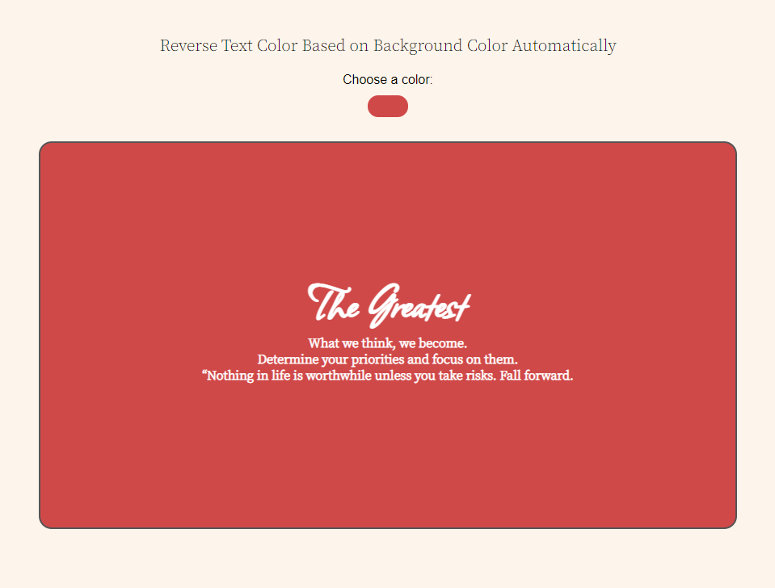

# Machine Leaning using Javascript

## Brain.js

```block
Brain.js is a GPU accelerated library of neural networks written in JavaScript for browsers and Node.js. It is simple, fast and easy to use. It provides multiple neural network implementations as different neural nets can be trained to do different things well.
```

## Getting Started

There are multiple ways to use this library:

- NPM
`npm install --save brain.js`

- CDN
`<script src="//unpkg.com/brain.js"></script>`

Project Preview [link 🤠](https://ullaskunder3.github.io/javascript-ml/)

| Preview 2                         | Preview 2                       |
|-----------------------------------|---------------------------------|
|    |  |

## Training

- Feedforward neural network (brain.NeuralNetwork)

One of the tasks that used the basic .NeuralNetwork flow was checking probability. Training data with `height` and `weight`

```task
 * pen = 13-14 cm, 8 grams => 1
 * 
 * pencil = 14 - 15 cm, 6 gram => 0
```

```js
network.train([
    {input: {height: 13, weight: 8}, output: {pen: 1} },
    {input: {height: 13, weight: 6}, output: {pencil: 0} },
    {input: {height: 14, weight: 8}, output: {pen: 1} },
    {input: {height: 15, weight: 6}, output: {pencil: 0} },
])

const result = network.run({height: 13, weight: 7})

console.log(result);
// { pen: 0.7718532681465149, pencil: 0.03233066201210022 }
```
